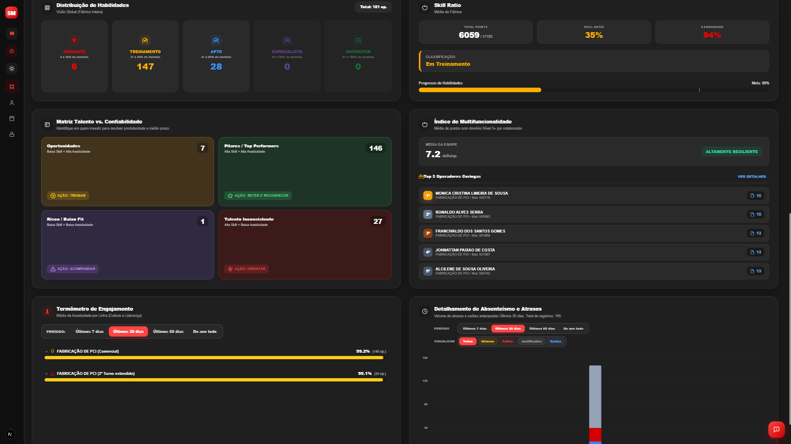
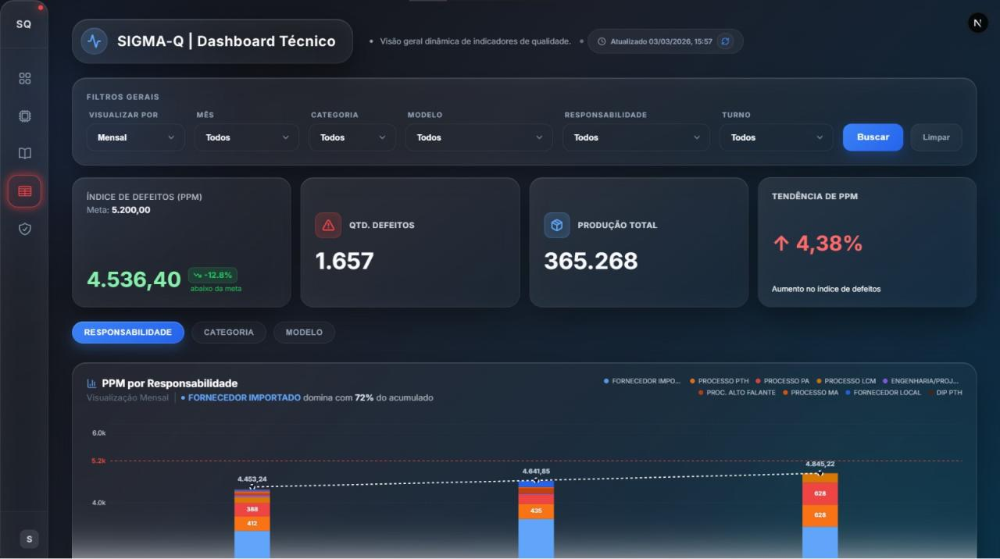
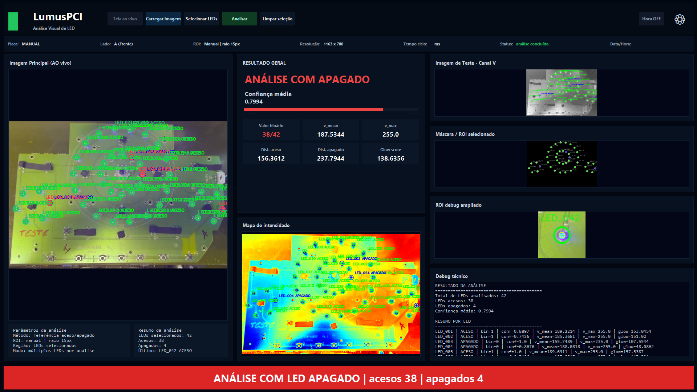
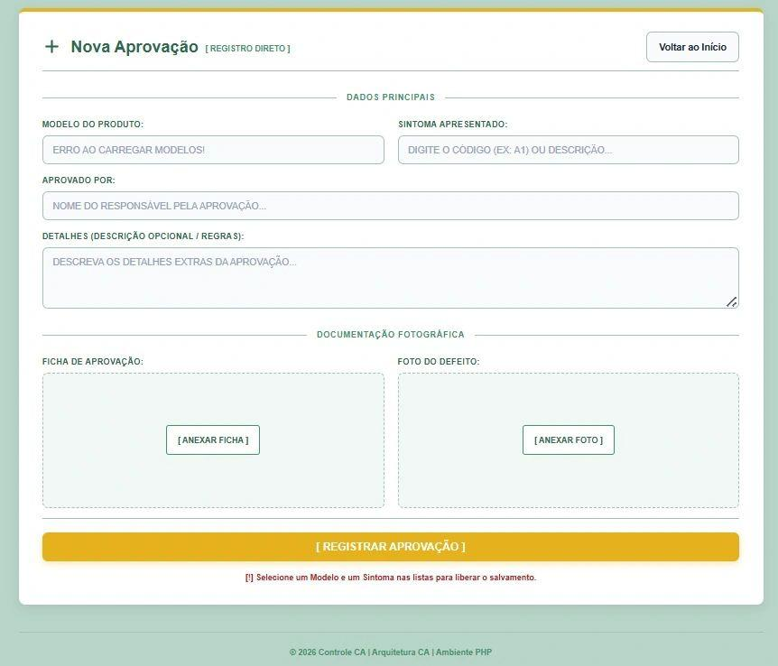
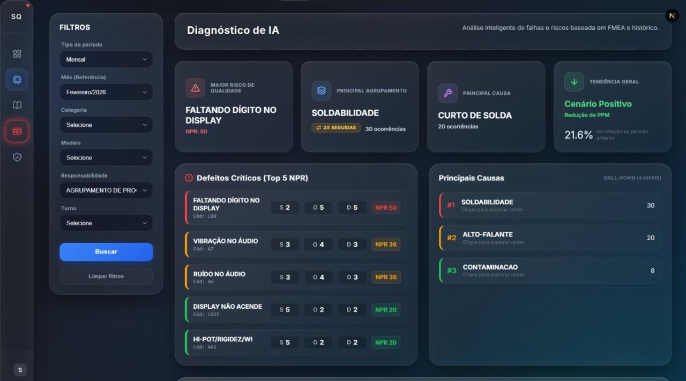

<h1 align="center">Carlos Daniel</h1>

  <b>Full Stack Developer • Electronics Technician • AI • Computer Vision • Industrial Systems</b>

  Building intelligent systems for production, quality, automation and visual inspection.

  
  

---

## Tech Stack

  

---

## GitHub Overview

  
  

---

## Featured Projects

<table>
  <tr>
    <td align="center" width="50%">
      <a href="https://github.com/carlosdaniel003/Skill-Map">
        
         
        <b>Skill Map</b>
      </a>
       
      Skills management • operators • attendance • dashboards
    </td>
    <td align="center" width="50%">
      <a href="https://github.com/carlosdaniel003/sigma-q-v5">
        
         
        <b>SIGMA-Q</b>
      </a>
       
      Quality indicators • PPM • FMEA • AI diagnosis
    </td>
  </tr>
  <tr>
    <td align="center" width="50%">
      <a href="https://github.com/carlosdaniel003/visionx-neural">
        
         
        <b>VisionX Neural</b>
      </a>
       
      Industrial visual inspection • computer vision • AI
    </td>
    <td align="center" width="50%">
      <a href="https://github.com/carlosdaniel003/LUMUS-PCI">
        
         
        <b>LUMUS-PCI</b>
      </a>
       
      Visual LED analysis • PCI inspection • technical validation
    </td>
  </tr>
  <tr>
    <td align="center" width="50%">
      <a href="https://github.com/carlosdaniel003/Central-de-Aprovacoes-CA">
        
         
        <b>Central de Aprovações CA</b>
      </a>
       
      Technical approval records • photographic documentation
    </td>
    <td align="center" width="50%">
      <a href="https://github.com/carlosdaniel003">
        
         
        <b>More Projects</b>
      </a>
       
      Automation • quality • production • full stack systems
    </td>
  </tr>
</table>

---

## Focus Areas

  
  
  
  

---

  <i>Turning real production problems into digital solutions.</i>

