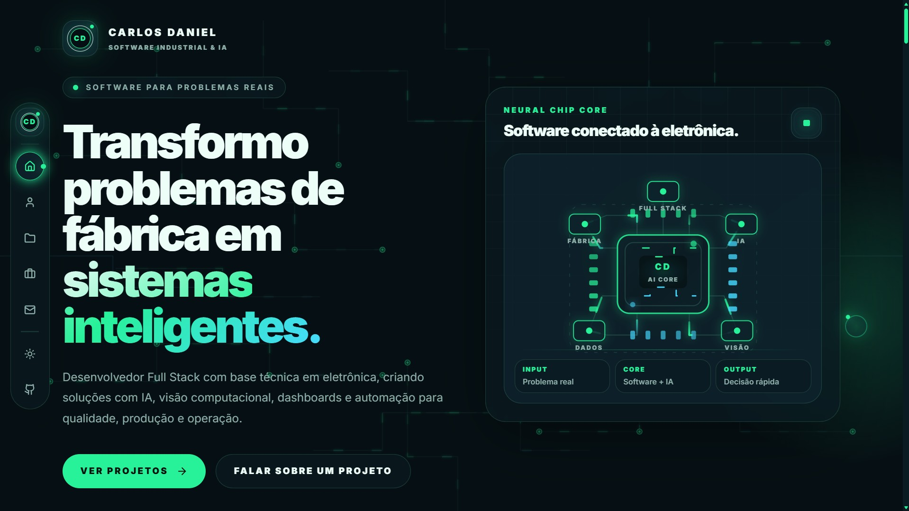

<div align="center">



<br>

# Carlos Daniel

### Software para problemas reais

Desenvolvedor Full Stack com base técnica em eletrônica, criando soluções com **Inteligência Artificial, Visão Computacional, análise de dados e automação** para qualidade, produção e operação industrial.

<br>

<a href="https://carlosdaniel.dev.br">
  
</a>
<a href="https://www.linkedin.com/in/carlosdaniel003/">
  
</a>
<a href="https://github.com/carlosdaniel003?tab=repositories">
  
</a>

</div>

---

## O que eu desenvolvo

<p align="center">
  
  
  
  
</p>

Transformo necessidades reais da indústria em sistemas capazes de:

- automatizar inspeções e análises;
- transformar dados operacionais em decisões;
- reduzir atividades manuais e retrabalho;
- conectar software, eletrônica e processos produtivos;
- apoiar qualidade, engenharia, produção e gestão.

---

## Tecnologias

<p align="center">
  
</p>

---

## Projetos em destaque

<table>
  <tr>
    <td align="center" width="50%">
      <a href="https://github.com/carlosdaniel003/Skill-Map">
        
        <br>
        <b>Skill Map</b>
      </a>
      <br>
      <sub>Gestão de operadores, habilidades, assiduidade, dashboards e apoio inteligente à formação de equipes.</sub>
    </td>
    <td align="center" width="50%">
      <a href="https://github.com/carlosdaniel003/sigma-q-v5">
        
        <br>
        <b>SIGMA-Q</b>
      </a>
      <br>
      <sub>Analytics de qualidade industrial com PPM, FMEA, NPR dinâmico, validação de dados e diagnóstico inteligente.</sub>
    </td>
  </tr>

  <tr>
    <td align="center" width="50%">
      <a href="https://github.com/carlosdaniel003/visionx-neural">
        
        <br>
        <b>VisionX Neural</b>
      </a>
      <br>
      <sub>Inteligência Artificial aplicada à inspeção óptica automatizada, visão computacional e aprendizado em ambiente industrial.</sub>
    </td>
    <td align="center" width="50%">
      <a href="https://github.com/carlosdaniel003/LUMUS-PCI">
        
        <br>
        <b>LUMUS-PCI</b>
      </a>
      <br>
      <sub>Sistema de visão computacional para inspeção automática de LEDs em placas PCI.</sub>
    </td>
  </tr>

  <tr>
    <td align="center" width="50%">
      <a href="https://github.com/carlosdaniel003/Central-de-Aprovacoes-CA">
        
        <br>
        <b>Central de Aprovações</b>
      </a>
      <br>
      <sub>Registro, armazenamento e consulta de aprovações técnicas e documentações fotográficas.</sub>
    </td>
    <td align="center" width="50%">
      <a href="https://github.com/carlosdaniel003/Portf-lio">
        
        <br>
        <b>Portfólio Profissional</b>
      </a>
      <br>
      <sub>Experiência interativa para apresentação dos meus projetos, competências e soluções.</sub>
    </td>
  </tr>
</table>

<p align="center">
  <a href="https://carlosdaniel.dev.br">
    
  </a>
</p>

---

## GitHub

<p align="center">
  
  
</p>

---

<div align="center">

### Problema real → Software + IA → Decisão mais rápida

Desenvolvo tecnologia para transformar processos industriais em soluções digitais mais inteligentes, rastreáveis e eficientes.

<br>

<a href="mailto:carlos.daniel.simoes.003@gmail.com">
  
</a>

<br><br>

[Portfólio](https://carlosdaniel.dev.br) •
[LinkedIn](https://www.linkedin.com/in/carlosdaniel003/) •
[Repositórios](https://github.com/carlosdaniel003?tab=repositories)

</div>
```
